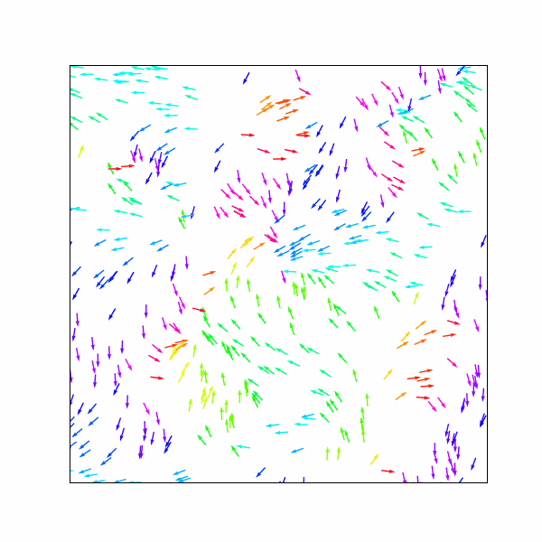

# Vicsek Model of Active Particles

This repository contains a NumPy-accelerated implementation of the Vicsek model (2D) for simulating collective motion of active particles.

## 🌐 Model Description

Particles self-propel at constant speed and align with their neighbors' direction within a fixed radius, with some random noise.

Features:
#- Vectorized for speed using NumPy
- Periodic boundary conditions
- Angle-based coloring of particles
- Realtime animation via matplotlib
- Option to save animation as MP4 and GIF

## 🚀 Run

```bash
pip install -r requirements.txt
python vicsek_model.py
```

## 📦 Dependencies

- numpy
- matplotlib
- scipy
- pillow (for saving .gif)

---

## 📘 Introduction

The **Vicsek model** is a cornerstone in the study of **active matter**, a class of systems composed of self-driven units capable of converting energy into motion. Introduced by Tamás Vicsek and collaborators in 1995, the model captures the emergence of **collective motion** and **swarming behavior** observed in systems ranging from bacterial colonies and bird flocks to synthetic microswimmers.

One of the key reasons for the model’s enduring relevance is its **minimalism**: it describes point-like particles moving at constant speed, aligning their direction with nearby neighbors under the influence of noise. Despite its simplicity, the Vicsek model exhibits **non-equilibrium phase transitions**, capturing the transition from disordered motion to globally aligned flocking — a form of **universality** that makes it an attractive paradigm in statistical physics.

This repository provides a fast, NumPy-accelerated implementation of the Vicsek model in 2D, including real-time animation, angle-based coloring, and tools for analyzing collective behavior.

## 🧮 Vicsek Model Equations

The **Vicsek model** describes collective motion in systems of self-propelled particles (e.g., birds, bacteria, robots), where each particle aligns its direction with nearby neighbors under noise.

At each timestep, the particles follow two main update rules:

### 1. Position Update

Each particle moves forward with a constant speed \( v_0 \):

\[
\vec{x}_i(t + \Delta t) = \vec{x}_i(t) + v_0 \cdot \hat{n}_i(t) \cdot \Delta t
\]

- \( \vec{x}_i(t) \): position of particle \( i \)
- \( \hat{n}_i(t) = (\cos \theta_i, \sin \theta_i) \): direction vector
- \( \theta_i \): angle of motion

---

### 2. Direction (Angle) Update

Each particle aligns its angle to the average direction of neighbors (within radius \( r \)), with added noise:

\[
\theta_i(t + \Delta t) = \text{Arg} \left[ \sum_{j \in \mathcal{N}_i} e^{i \theta_j(t)} \right] + \eta \cdot \xi_i(t)
\]

- \( \mathcal{N}_i \): set of neighbors of particle \( i \)
- \( \eta \): noise strength
- \( \xi_i(t) \in [-\pi, \pi] \): uniform noise

---

### 3. Periodic Boundary Conditions

\[
\vec{x}_i \leftarrow \vec{x}_i \mod L
\]

Wraps particles around a square box of size \( L \times L \).

---

### 📖 Reference

> Vicsek, T., Czirók, A., Ben-Jacob, E., Cohen, I., & Shochet, O. (1995).  
> "Novel type of phase transition in a system of self-driven particles", *Phys. Rev. Lett.*, 75(6), 1226.

---

## 🎬 Output

This script generates:
- `animation.mp4`: high-quality video
- `animation.gif`: embeddable animated GIF

You can embed the GIF in your `README.md`:

```markdown

```

